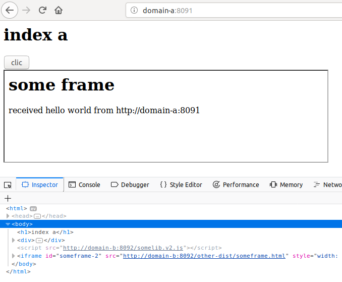

# Configuration

## /etc/hosts
```
127.0.0.1       domain-a
127.0.0.1       domain-b
```

## configuration Apache

###  /etc/apache2
```
Listen 8091
Listen 8092
```

### /etc/apache2/sites-available/domain-a.conf
```
<VirtualHost *:8091>
        #nom de domaine
        ServerName domain-a  
        #on accepte aussi le www
        ServerAlias www.domain-a 
        #logs d'erreur
        ErrorLog /var/vhosts/domain-a/logs/error.log 
        #logs de connexion
        CustomLog /var/vhosts/domain-a/logs/access.log common
        #Définition de la racine des sources php
        DocumentRoot "/var/vhosts/domain-a/web/"
        <Directory /var/vhosts/domain-a/web/>
                DirectoryIndex index.php
                Options -Indexes +FollowSymLinks +MultiViews
                AllowOverride All
                Require all granted
        </Directory>
</VirtualHost>
```
sudo a2ensite domain-a.conf

### /etc/apache2/sites-available/domain-b.conf
```
<VirtualHost *:8092>
        #nom de domaine
        ServerName domain-b
        #on accepte aussi le www
        ServerAlias www.domain-b
        #logs d'erreur
        ErrorLog /var/vhosts/domain-b/logs/error.log
        #logs de connexion
        CustomLog /var/vhosts/domain-b/logs/access.log common
        #Définition de la racine des sources php
        DocumentRoot "/var/vhosts/domain-b/web/"

        Header set Access-Control-Allow-Origin "*"

        <directory /var/vhosts/domain-b/web/>
                Options -Indexes +FollowSymLinks +MultiViews
                AllowOverride All
                Require all granted
        </Directory>
</VirtualHost>
```
sudo a2ensite domain-b.conf

## problème de l'url de l'iframe

Le js servi par domain-b s'exécute dans domain-a. Ce js crée une iframe dont le contenu est lui aussi servi par domain-b

Donc le js doit déduire sa root url depuis sa balise script (!)

domain-b/web/somelib.v*.js
```
let bundleFullURL = document.querySelector('script[src$="somelib.v1.js"]').getAttribute('src');
const contextRootUrl = bundleFullURL.replace("somelib.v1.js","");
someframe.setAttribute("src", contextRootUrl + "other-dist/someframe.html");
```

# pb initial


# solution postMessage

domain-a/web/index.php
```
<script src="http://domain-b:8092/somelib.v2.js"></script>
```



# sous-domaine.domain-a proxy

reverse proxy

https://www.digitalocean.com/community/tutorials/how-to-use-apache-http-server-as-reverse-proxy-using-mod_proxy-extension

https://perhonen.fr/blog/2015/05/un-reverse-proxy-apache-avec-mod_proxy-1713

https://www.tomred.net/devops/run-two-virtual-hosts-the-same-port.html

```
<VirtualHost *:8091
    ServerName sous-domaine.domain-a
 
    ProxyPass / domain-b
    ProxyPassReverse / domain-b
    ProxyRequests Off
</VirtualHost>
```

# solution proxy php (bof)

(TODO)

https://stackoverflow.com/questions/6425666/how-to-proxy-another-page-in-php

# solution sans proxy

Attention : le navigateur requêtera directement l'IP de domain-b. Donc en HTTPS il faudra importer un certificat de domain-a côté domain-b

```
<VirtualHost *:8091
    ServerName sous-domaine.domain-a
 
    ProxyPass / <<IP de domain-b>>
    ProxyPassReverse / <<IP de domain-b>>
    ProxyRequests Off
</VirtualHost>
```
